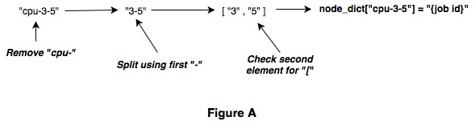
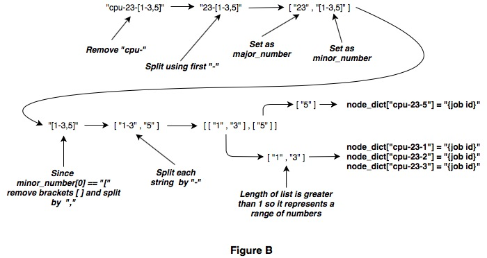

# HPCC Job & Node Data

- `slurm_nodes_with_jobs/`: Contains the txt files with combined nodes and job ids.
- `fetch_slurm_data.py`: Main file that refreshes the API key if needed, retrieves node and job data, and passes that data to process_data.py.
- `process_data.py`: Processes the job ids into the node information and outputs that data into a txt file in slurm_nodes_with_jobs/.
- `refresh_key.py`: Refreshes the Slurm API key if it has expired.

Project Description
-------------------

This project utilizes the Slurm API configured with the High Performance Computing Center at Texas Tech University in order to retrieve current job and node information on the RedRaider Cluster and consolidate the job ids with the nodes information. This is performed by first retrieving the job information and the node information inside the main file, fetch_slurm_data.py. In order to do so there are two functions, fetch_slurm_jobs() and fetch_slurm_nodes(). These both are essentially the same function except one makes the API call for jobs and the other for nodes. This is performed using the requests package and requires an eraider username and token for parameters. For security purposes this token is only set to last an hour so the first thing these functions do is call the get_key() function. This checks the first line of the slurm_key.txt file, which using the time.time() function holds the number of seconds since 01/01/1970. If this time minus the current time is greater than an hour then the key is refreshed using refresh_key.py. In this file a new time is first printed to slurm_key.py followed by a new key, which is retrieved through the terminal by running a command to the RedRaider cluster using subprocess. After the key is checked and potentially refreshed the functions, fetch_slurm_jobs() and fetch_slurm_nodes(), make their API calls and return the data in JSON format. In the main section of fetch_slurm_data.py this data is next sent to the add_jobs_to_nodes(nodes, jobs) function in process_data.py.

This function scrapes the job ids and CPU nodes from the job information and then the nodes are parsed so the job ids can be added to each node.The nodes can be in a few different formats so this had to be accounted for. For example they could be cpu-3-5, which would be a single CPU node, or cpu-23-[1-3,5], which would contain a set of nodes with one being a range. The function starts by initializing an empty dictionary called node_dict. This is going to be used to store each CPU node and corresponding job id so we can add the job ids to every CPU node in the nodes information JSON file later on. The first step in scraping this information is to loop through every job in the job data that was passed into the add_jobs_to_nodes(nodes, jobs) function. For each job we isolate the numbers from the CPU node name by removing "cpu-", so cpu-3-5 would become 3-5 and cpu-23-[1-3,5] would become 23-[1-3,5]. Next the major and minor numbers are separated using only the first hyphen "-" in the string as a separator, so they would become ['3','5'] and ['23','[1-3,5]']. The minor number's first character is then checked for an open bracket "[" to see if it represents a set.

If the first character is not an open bracket "[", as seen in Figure A, then that means it only represents a single CPU node. This individual CPU node is then added to the node_dict dictionary as the key with the job id being the value.

If the first character is not an open bracket [, as seen in Figure B, then the string represents a set and is separated using a comma "," as a separator. Each element of this new list is then split using a hyphen "-" as a separator. If there was a hyphen present then the length of the new list is now greater than one and we can check for this and know it represents a range of numbers. If this is the case, such as it is for the first item ["1","3"] in the list depicted in Figure B, then we go through a loop adding every CPU node in this range to the node_dict dictionary as the key with the job id as the value. If the length of that new list isn't greater than one after being split using a hyphen "-" as a separator then we know it's just an individual CPU node, such as it is for the second item ["5"] in the list depicted in Figure B. Then we just add that individual node to node_dict as the key with the job id as the value.

After we have looped through every job we then loop through every node that was in the node data passed into the add_jobs_to_nodes(nodes, jobs) function. For each of these nodes the node name is formatted like discussed earlier, such as cpu-3-5, so we simply check if the name is in node_dict and if it is we add the value for that item in node_dict to the node data with the key "jobs". If the node name isn't in node_dict then we simply add empty brackets to that node item again with the key "jobs". This updated node information that now contains the jobs being run on each node is then written to a prettified txt file titled with the datetime and located in the "slurm_nodes_with_jobs/" file.
